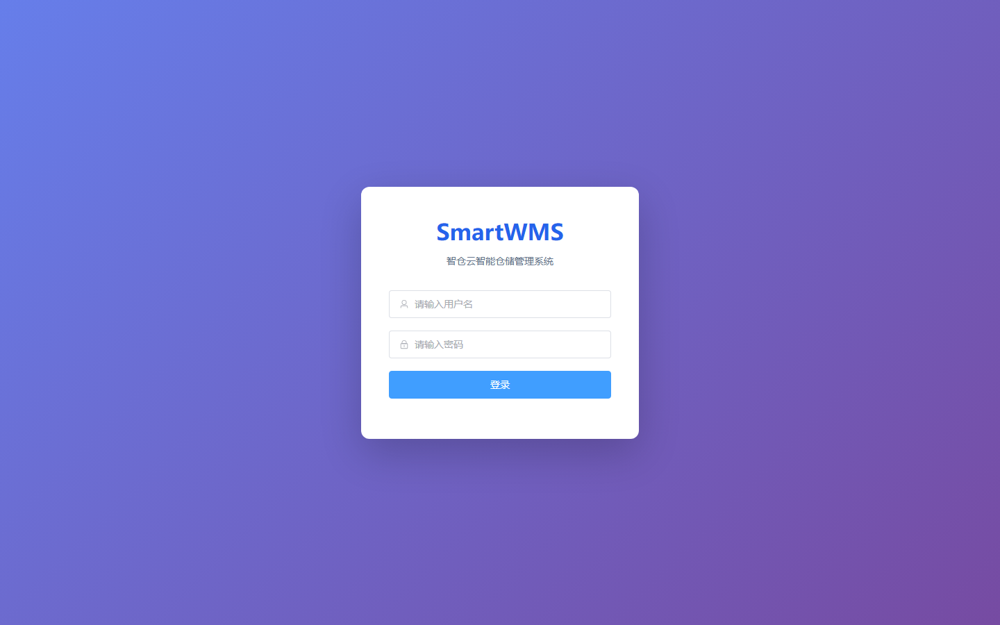
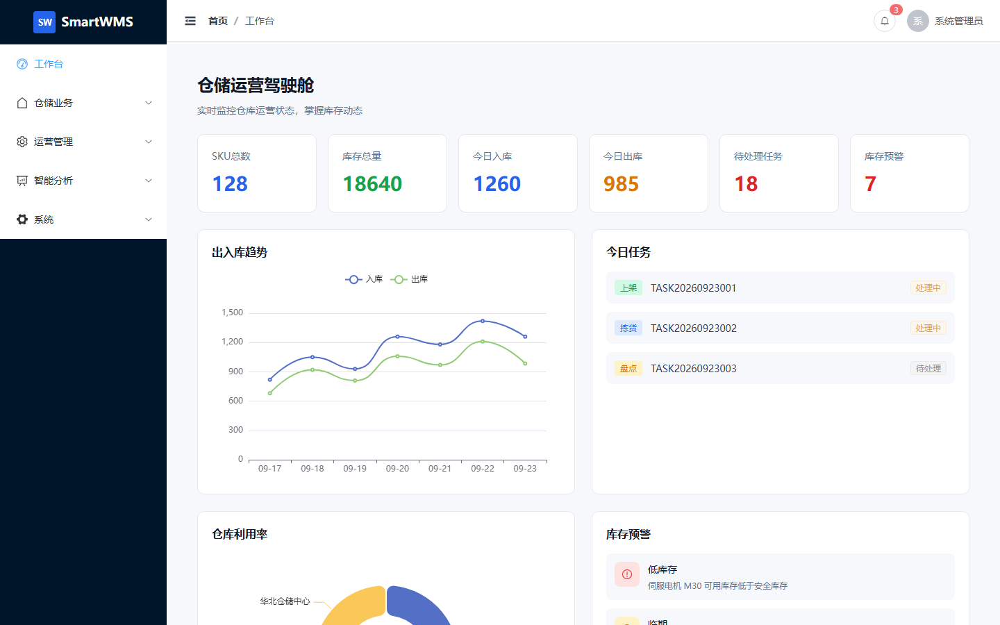
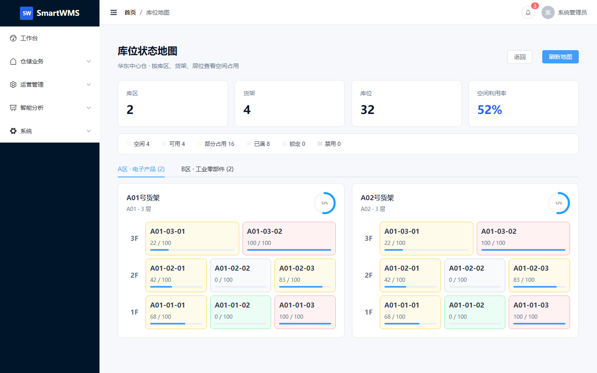
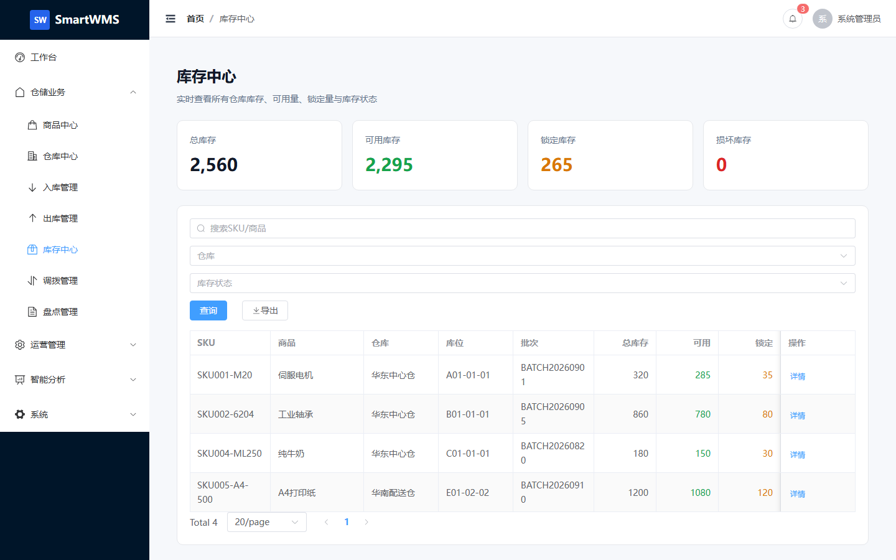
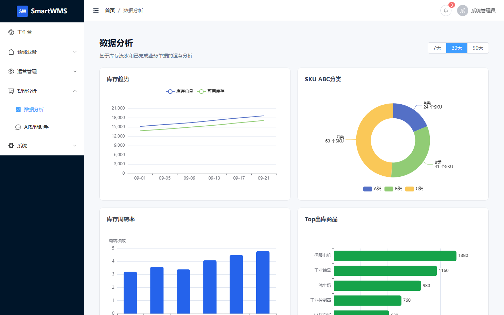

# SmartWMS - 智仓云智能仓储管理系统

[](https://github.com/yuzhou602/smart-wms/actions/workflows/ci.yml)

AI-Driven Intelligent Warehouse Management System

## 项目介绍

SmartWMS 是一个现代化的企业级智能仓储管理系统，采用前后端分离架构，集成了 AI 智能助手功能，适用于中小型制造企业、电商仓储中心、企业内部物料仓库等场景。

### 核心特性

- **仓储业务管理**：入库、出库、盘点、调拨和任务管理
- **多级库存模型**：仓库 → 库区 → 货架 → 库位 → SKU → 批次
- **库存锁定机制**：支持库存预占、锁定、释放，避免超卖
- **AI智能助手**：自然语言查询仓储数据，智能分析库存风险
- **数据驾驶舱**：实时监控仓库运营状态，多维度数据分析
- **RBAC权限体系**：用户、角色、权限与操作日志管理

当前版本已覆盖日常演示和中小规模内部试用。FIFO/FEFO 自动分配、分布式库存锁、库位推荐算法和事件驱动通知仍属于后续增强项，生产使用前应结合实际业务规则补充并发与压力测试。

## 项目预览

> 以下界面使用演示数据展示，实际数据以部署环境为准。

### 登录页面



### 仓储运营驾驶舱



### 库位状态地图



### 库存中心



### 数据分析



## 技术架构

### 前端技术栈

- Vue 3 + TypeScript
- Vite
- Element Plus
- Tailwind CSS
- ECharts
- Pinia
- Vue Router

### 后端技术栈

- Java 21
- Spring Boot 3.5.x
- Spring Security + JWT
- MyBatis Plus
- MySQL 8.0
- Redis
- Springdoc OpenAPI

## 项目结构

```
smart-wms/
├── backend/                    # 后端项目
│   ├── src/main/java/com/smartwms/
│   │   ├── common/            # 通用模块（异常、响应、工具）
│   │   ├── security/          # 安全模块（JWT、认证）
│   │   ├── system/            # 系统管理（用户、角色、权限）
│   │   ├── product/           # 商品中心
│   │   ├── warehouse/         # 仓库中心
│   │   ├── inventory/         # 库存核心
│   │   ├── inbound/           # 入库管理
│   │   ├── outbound/          # 出库管理
│   │   ├── transfer/          # 调拨管理
│   │   ├── stocktake/         # 盘点管理
│   │   ├── task/              # 任务中心
│   │   ├── alert/             # 预警中心
│   │   ├── analytics/         # 数据分析
│   │   └── ai/                # AI智能助手
│   └── src/main/resources/
│       ├── application.yml
│       └── db/
│           ├── schema.sql     # 数据库表结构
│           └── data.sql       # 初始数据
├── frontend/                   # 前端项目
│   ├── src/
│   │   ├── api/               # API接口
│   │   ├── assets/            # 静态资源
│   │   ├── components/        # 公共组件
│   │   ├── layouts/           # 布局组件
│   │   ├── router/            # 路由配置
│   │   ├── stores/            # Pinia状态管理
│   │   ├── styles/            # 全局样式
│   │   ├── types/             # TypeScript类型
│   │   ├── utils/             # 工具函数
│   │   └── views/             # 页面视图
│   └── package.json
└── docker-compose.yml         # Docker编排
```

## 快速开始

### 环境要求

- JDK 21+
- Node.js 22+
- MySQL 8.0+
- Redis 7+

### 本地开发

#### 后端启动

```bash
cd backend
mvn spring-boot:run
```

后端服务启动在 http://localhost:8080/api/v1

#### 前端启动

```bash
cd frontend
npm install
npm run dev
```

前端服务启动在 http://localhost:3000

### Docker启动

```bash
cp .env.example .env
# 编辑 .env，设置强数据库密码、Redis 密码和 JWT 密钥
docker-compose up -d
```

AI 助手默认关闭。如需启用，请在 `.env` 中设置 `AI_CHAT_PROVIDER=openai`，并填写 `AI_API_KEY`、`AI_BASE_URL` 和 `AI_MODEL`。

服务启动后：
- 前端：http://localhost
- 后端API：http://localhost:8080/api/v1

生产配置默认关闭 Swagger。需要查看接口文档时，请使用本地开发配置访问：http://localhost:8080/api/v1/swagger-ui.html

## 默认账号

| 用户名 | 密码 | 角色 |
|--------|------|------|
| admin | admin123 | 超级管理员 |
| warehouse_manager | admin123 | 仓库主管 |
| inbound_operator | admin123 | 入库员 |
| outbound_operator | admin123 | 出库员 |

> 上述账号仅用于首次初始化和本地演示。首次登录后请立即通过右上角用户菜单修改密码，生产环境禁止继续使用默认密码。

## API文档

启动后端服务后，访问 Swagger 文档：
http://localhost:8080/api/v1/swagger-ui.html

## 数据库设计

系统包含以下核心表：

- **系统管理**：sys_user, sys_role, sys_permission
- **商品中心**：wms_product, wms_sku, wms_category
- **仓库中心**：wms_warehouse, wms_zone, wms_rack, wms_location
- **库存核心**：wms_inventory, wms_inventory_transaction, wms_inventory_lock
- **入库管理**：wms_inbound_order, wms_inbound_order_item, wms_putaway_task
- **出库管理**：wms_outbound_order, wms_outbound_order_item, wms_picking_task
- **调拨管理**：wms_transfer_order, wms_transfer_order_item
- **盘点管理**：wms_stocktake, wms_stocktake_item
- **预警中心**：wms_inventory_alert
- **AI助手**：ai_conversation, ai_message, ai_tool_call

## 核心业务流程

### 入库流程

```
创建入库单 → 审核 → 收货 → 上架 → 库存增加 → 生成流水
```

### 出库流程

```
创建出库单 → 审核 → 锁定库存 → 拣货 → 发货 → 库存扣减 → 生成流水
```

### 盘点流程

```
创建盘点计划 → 选择仓库/库区 → 生成盘点任务 → 实际盘点 → 录入数量 → 计算差异 → 主管审核 → 库存调整
```

## AI智能助手

系统集成了 AI Warehouse Copilot，支持以下功能：

- 自然语言查询库存数据
- 库存风险智能分析
- 仓储异常分析

### AI工具函数

- `queryInventory()` - 查询库存
- `querySkuInventory()` - 查询SKU库存
- `queryWarehouseUtilization()` - 查询仓库利用率
- `queryLowStock()` - 查询低库存
- `queryExpiringBatch()` - 查询临期批次
- `querySlowMovingInventory()` - 查询呆滞库存
- `queryInboundOrders()` - 查询入库单
- `queryOutboundOrders()` - 查询出库单
- `queryWarehouseTasks()` - 查询任务

## 项目亮点

1. **多维库存模型**：支持仓库+库位+SKU+批次的精细化库存管理
2. **库存预占**：出库审核时锁定可用库存，取消或出库时释放、扣减
3. **业务模块完整**：商品、仓库、批次、任务、盘点、调拨和预警统一管理
4. **AI助手**：集成 Spring AI，通过工具函数查询仓储数据
5. **权限与审计**：基于角色控制菜单和接口权限，记录关键操作日志
6. **容器化部署**：提供 Docker Compose 编排和生产环境安全默认值

## License

MIT
